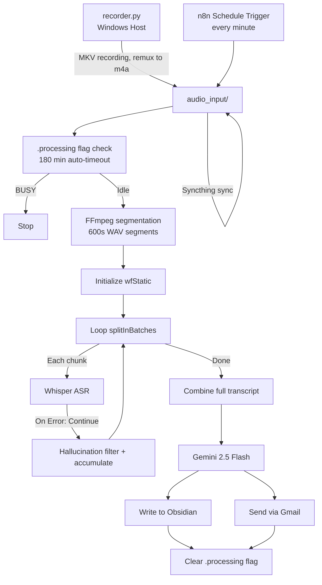
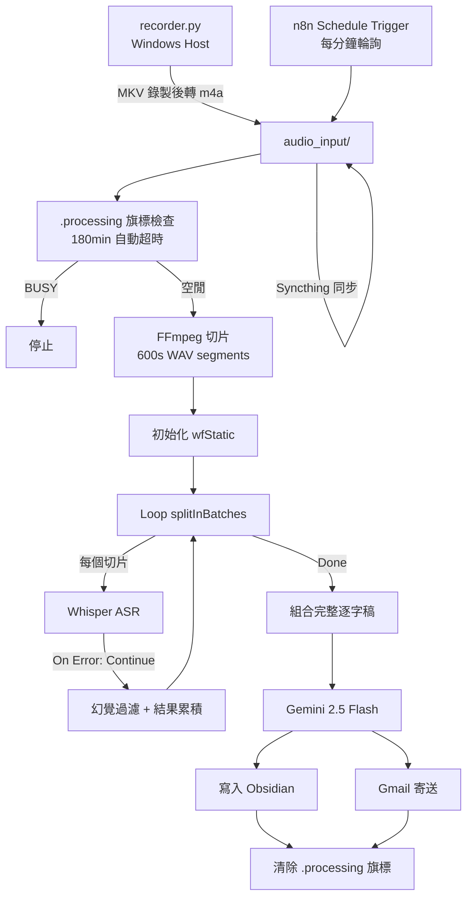

[English](#english) | [繁中](#繁中版)

---

<a name="english"></a>

# Lecture Audio Automation System

An automated pipeline that transcribes lecture recordings, generates structured notes and quiz questions, saves them to Obsidian, and emails the result to Gmail — without any manual steps after the recording ends.


## Motivation

There is never enough time to organize notes after class, and recorded audio sitting idle on a phone is a waste. Once a recording finishes, this system handles everything: transcription, note generation, Obsidian storage, and Gmail delivery — zero manual intervention required.

## System Architecture

```
recorder.py (Windows)
    ↓  MKV recording → remux to m4a
audio_input/
    ↓  Syncthing sync (phone or laptop)
n8n Schedule Trigger (polls every minute)
    ↓  find detects new audio file
.processing flag (prevents duplicate processing)
    ↓
FFmpeg segmentation (10-minute WAV chunks)
    ↓
Loop → Whisper ASR (local GPU) → hallucination filter → accumulate results
    ↓
Gemini 2.5 Flash (generate notes + quiz questions)
    ↓
Write to Obsidian + send via Gmail
    ↓
Clear .processing flag
```



## Technology Stack

| Component | Purpose |
|-----------|---------|
| n8n (custom image with FFmpeg 7.0.2) | Automation engine |
| fedirz/faster-whisper-server:latest-cuda | Local GPU ASR server |
| Systran/faster-whisper-large-v3 | ASR model |
| Gemini 2.5 Flash | Note and quiz generation |
| Obsidian (local vault) | Note storage |
| Gmail (n8n OAuth2) | Note delivery |
| Syncthing | Cross-device audio sync |
| Docker + Docker Compose + WSL2 | Containerized deployment |
| Python 3 (tkinter + ffmpeg dshow) | Recording frontend |

## Requirements

- Windows 10/11 with WSL2 (Ubuntu)
- Docker Desktop with WSL2 Integration enabled
- NVIDIA Driver 580.88 or newer
- NVIDIA GPU with CUDA support (developed on RTX 4060 8GB)
- RAM: 16 GB minimum
- Disk: ~3 GB for model cache

## Quick Start

```bash
# 1. Clone the repository
git clone <repo-url>
cd lecture-autopilot

# 2. Create required directories
mkdir -p n8n_data audio_input whisper_models

# 3. Copy and edit the configuration
cp docker-compose.example.yml docker-compose.yml
# Edit docker-compose.yml — set your Obsidian vault path

# 4. Build and start (first run downloads static FFmpeg, ~1–2 min)
docker compose up -d --build

# 5. Verify container status
docker compose ps

# 6. Pre-load the Whisper model (required on first run to avoid timeout)
# Open http://localhost:9000/docs
# Execute POST /api/ps/Systran%2Ffaster-whisper-large-v3
# A 409 "Model already loaded" response means success

# 7. Open n8n
# Open http://localhost:5678
# Import workflow.json, then link Gmail and Gemini credentials
```

## Configuration

### docker-compose.yml

Replace `YOUR_OBSIDIAN_VAULT_PATH` with the actual path to your local Obsidian vault:

```yaml
volumes:
  - "YOUR_OBSIDIAN_VAULT_PATH:/data/obsidian_vault"
```

Other variables:

| Parameter | Purpose | Value |
|-----------|---------|-------|
| `user: "root"` | Bypasses WSL2 ACL restrictions when mounting Windows drives | `"root"` |
| `N8N_USER_FOLDER` | Must point to `/home/node` after switching to root; otherwise workflows disappear | `/home/node` |
| `NODES_EXCLUDE` | Exposes Execute Command and other nodes hidden by default | `[]` |
| `N8N_RESTRICT_FILE_ACCESS_TO` | n8n file access whitelist | `/root/.n8n-files` |
| `N8N_GRACEFUL_SHUTDOWN_TIMEOUT` | Gives SQLite WAL time to checkpoint before shutdown, preventing data loss | `30` (seconds) |

### recorder.py

Open the file and modify the variables near the top:

```python
# To find device names, run in CMD:
# ffmpeg -list_devices true -f dshow -i dummy > devices.txt 2>&1
MIC_DEVICE = "YOUR_MIC_DEVICE_NAME"
SYSTEM_DEVICE = "YOUR_SYSTEM_AUDIO_DEVICE_NAME"

# Audio output path
base_save_path = r"C:\YOUR_PATH\audio_input"

# Obsidian vault path (used when creating new category folders)
# Modify inside the add_category function
obsidian_vault_path = r"C:\YOUR_OBSIDIAN_VAULT"
```

### n8n Workflow Setup

After importing `workflow.json`:

1. **Link Gmail credentials** — find all Gmail nodes and connect your OAuth2 account.
2. **Link Gemini credentials** — find all Gemini nodes and enter your Google PaLM API Key.
3. **Set recipient address** — update the `sendTo` field in all Gmail nodes to your email address.
4. **Activate the workflow** — toggle it to Active in the top-right corner.

## Core Mechanisms

### Duplicate Processing Prevention

The system uses `/root/.n8n-files/.processing` as a lock file to prevent the same audio from triggering the pipeline more than once. The lock includes a 180-minute automatic timeout to prevent a permanent hang if the workflow is interrupted.

Manual removal:

```bash
# Windows — double-click clear_flag.bat
# Or in WSL:
docker exec n8n_core rm -f /root/.n8n-files/.processing
```

### Why MKV for Recording

The m4a format writes its index table (moov atom) at the end of the file. If FFmpeg is interrupted before that point, the entire file is unrecoverable (Error `0xC00D3707`). MKV is a streaming format; an interruption loses at most the last few seconds. After recording, the file is remuxed to m4a using `-c copy` — no re-encoding, and the process takes about 10–30 seconds for a 3-hour file.

### Whisper Hallucination Suppression

Silent or noisy audio segments can push Whisper into a repetition loop, producing large amounts of meaningless text. Two layers of defense are used:

**API parameters:**
```
vad_filter=true
condition_on_previous_text=false
temperature=0
compression_ratio_threshold=2.4
```

**JavaScript post-processing:**
```javascript
function cleanHallucinations(text) {
  let cleaned = text.replace(/(.{2,10}?)\1{3,}/g, '$1');
  cleaned = cleaned.replace(/(.)\\1{5,}/g, '$1');
  return cleaned.trim();
}
```

### Why Schedule Trigger Instead of Local File Trigger

When files are written to a WSL2 Docker volume from the Windows host, Linux inotify events are not triggered. This completely breaks n8n's Local File Trigger. Using a Schedule Trigger that runs a `find` command every minute requires no external dependencies and is fully reliable.

## Startup Script

Run `start_automation.bat` after each reboot. It will:

1. Check whether Docker Desktop is running and start it if not.
2. Run `docker compose up -d` from the correct project directory.
3. Poll until n8n is ready.
4. Open `http://localhost:5678` in the browser.

> **Note:** The `.bat` script must `cd` into the project root before running `docker compose`. Running it from another directory causes Docker to mount volumes against `%USERPROFILE%`, creating a fresh empty database and erasing all workflows.

## File Structure

```
lecture-autopilot/
├── Dockerfile                  # Custom n8n image with static FFmpeg
├── docker-compose.yml          # Service configuration (edit Obsidian path)
├── docker-compose.example.yml  # Template
├── recorder.py                 # Windows recording frontend (edit device names)
├── workflow.json               # Exported n8n workflow
├── start_automation.bat        # One-click startup script
├── start_automation.sh         # Startup logic (called by the .bat)
├── clear_flag.bat              # Manually clear the .processing flag
├── categories.txt.example      # Course category template
├── .gitignore
└── README.md
```

Directories (not under version control):

```
├── n8n_data/                   # n8n database and settings
├── audio_input/                # Audio input directory
├── whisper_models/             # Whisper model cache
└── backups/                    # Automatic SQLite backups
```

## Troubleshooting

**Whisper API returns 500**

The model is not pre-loaded, or a completely silent chunk was passed. Run `POST /api/ps/Systran%2Ffaster-whisper-large-v3` via Swagger UI to pre-load. Silent chunk crashes are expected behavior — set the n8n Whisper node Settings → On Error to **Continue (using error output)** to skip them.

**ASR outputs large amounts of repeated text**

`compression_ratio_threshold` is set too low (must be `2.4`, not `1.0`), or the binary field name in n8n is inconsistent. Add this to the Code node:
```javascript
binary: { data: Object.values(item.binary)[0] }
```

**`find` command does not detect Syncthing-synced files**

Syncthing preserves original modification timestamps, so a newly synced file may have a timestamp older than the reference point. Use `-mmin` instead of `-newer`:
```bash
find /root/.n8n-files -name "*.wav" -not -path "*/temp_chunks/*" -mmin -2 | head -1
```

**Workflows disappear after reboot**

Confirm `docker-compose.yml` has `N8N_USER_FOLDER=/home/node`, and that the startup script `cd`s into the project directory first. Compare the size of `database.sqlite` inside the container — a few hundred MB is correct; a few hundred KB means a new empty database was mounted.

**Whisper container CUDA error**

After a WSL2 crash, restoring the GPU context requires a full Windows reboot, not just waking from sleep. After rebooting, re-verify the WSL Integration setting in Docker Desktop.

**Microphone shows signal but recording is silent**

The laptop's hardware privacy shortcut (Fn + Mic key) was likely triggered, cutting microphone input at the OS level. Press the shortcut again to restore it.

## Known Limitations

- Severe noise or total silence can still produce minor hallucinations even with dual-layer filtering.
- The Schedule Trigger introduces a maximum 60-second delay before processing begins.
- Gemini node retry intervals cannot be set below 5 seconds due to n8n constraints (60 seconds would be ideal).
- Meeting mode has no Speaker Diarization support.
- Requires an NVIDIA GPU; the container will not start without CUDA support.

## License

Apache-2.0 license — see [LICENSE](LICENSE) for details.

---

<a name="繁中版"></a>

# 課堂錄音全自動化處理系統

課堂錄音結束後，打開信箱就能看到結構化筆記。

[English](#english)

## 動機

上完課沒時間整理筆記，但又不想讓錄音只是躺在手機裡。這個系統做的事情很簡單：錄音完成後自動轉文字、自動生成筆記和測驗題、自動存進 Obsidian、自動寄到 Gmail。全程不需要手動介入。

## 系統架構

```
recorder.py (Windows)
    ↓  MKV 錄製 → 轉封裝 m4a
audio_input/
    ↓  Syncthing 同步（手機 / 筆電皆可）
n8n Schedule Trigger（每分鐘輪詢）
    ↓  find 偵測新音檔
.processing 旗標（防止重複處理）
    ↓
FFmpeg 切片（10 分鐘 WAV segments）
    ↓
Loop → Whisper ASR（本地 GPU）→ 幻覺過濾 → 結果累積
    ↓
Gemini 2.5 Flash（生成筆記 + 測驗題）
    ↓
Obsidian 寫入 + Gmail 寄送
    ↓
清除 .processing 旗標
```



## 技術棧

| 元件 | 用途 |
|------|------|
| n8n（自建 Image，含 FFmpeg 7.0.2） | 自動化流程引擎 |
| fedirz/faster-whisper-server:latest-cuda | 本地 GPU ASR 服務 |
| Systran/faster-whisper-large-v3 | ASR 模型 |
| Gemini 2.5 Flash | 筆記與測驗題生成 |
| Obsidian（本地 Vault） | 筆記儲存 |
| Gmail（n8n OAuth2） | 筆記寄送 |
| Syncthing | 跨裝置音檔同步 |
| Docker + Docker Compose + WSL2 | 容器化部署 |
| Python 3（tkinter + ffmpeg dshow） | 錄音前端 |

## 環境需求

- Windows 10/11 + WSL2（Ubuntu）
- Docker Desktop，需啟用 WSL2 Integration
- NVIDIA Driver 580.88+
- NVIDIA GPU，支援 CUDA（開發環境：RTX 4060 8GB）
- RAM 16GB 以上
- 磁碟空間：模型快取約 3GB

## 快速開始

```bash
# 1. Clone 專案
git clone <repo-url>
cd lecture-autopilot

# 2. 建立必要目錄
mkdir -p n8n_data audio_input whisper_models

# 3. 複製並修改設定
cp docker-compose.example.yml docker-compose.yml
# 編輯 docker-compose.yml，修改 Obsidian Vault 路徑

# 4. 建置並啟動（首次會下載 FFmpeg 靜態檔，約需 1-2 分鐘）
docker compose up -d --build

# 5. 確認容器狀態
docker compose ps

# 6. 預載 Whisper 模型（首次必做，避免第一次呼叫 timeout）
# 瀏覽器開啟 http://localhost:9000/docs
# 執行 POST /api/ps/Systran%2Ffaster-whisper-large-v3
# 回傳 409 "Model already loaded" 表示成功

# 7. 開啟 n8n
# 瀏覽器開啟 http://localhost:5678
# 匯入 workflow.json，並連結 Gmail 和 Gemini credentials
```

## 設定說明

### docker-compose.yml

將 `YOUR_OBSIDIAN_VAULT_PATH` 替換為本機 Obsidian Vault 的實際路徑：

```yaml
volumes:
  - "YOUR_OBSIDIAN_VAULT_PATH:/data/obsidian_vault"
```

其餘設定通常不需要修改。各環境變數說明：

| 參數 | 說明 | 建議值 |
|------|------|--------|
| `user: "root"` | 穿透 WSL2 掛載 Windows 磁碟的 ACL 權限限制 | `"root"` |
| `N8N_USER_FOLDER` | 切換 root 後必須明確指回資料目錄，否則 Workflow 消失 | `/home/node` |
| `NODES_EXCLUDE` | 顯示 Execute Command 等預設隱藏節點 | `[]` |
| `N8N_RESTRICT_FILE_ACCESS_TO` | n8n 可存取的路徑白名單 | `/root/.n8n-files` |
| `N8N_GRACEFUL_SHUTDOWN_TIMEOUT` | 確保 SQLite WAL 有時間 checkpoint，避免重啟資料遺失 | `30`（秒） |

### recorder.py

開啟檔案，修改頂部的以下變數：

```python
# 取得裝置名稱：在 CMD 執行以下指令，查看輸出中 (audio) 旁邊的名稱
# ffmpeg -list_devices true -f dshow -i dummy > devices.txt 2>&1
MIC_DEVICE = "YOUR_MIC_DEVICE_NAME"
SYSTEM_DEVICE = "YOUR_SYSTEM_AUDIO_DEVICE_NAME"

# 音檔儲存路徑
base_save_path = r"C:\YOUR_PATH\audio_input"

# Obsidian Vault 路徑（新增課程類別時自動建立資料夾用）
# 在 add_category 函式中修改
obsidian_vault_path = r"C:\YOUR_OBSIDIAN_VAULT"
```

### n8n Workflow 匯入後的設定

匯入 `workflow.json` 後，需要手動處理以下事項：

1. **連結 Gmail credentials**：找到所有 Gmail 節點，連結你的 Gmail OAuth2 帳號。
2. **連結 Gemini credentials**：找到所有 Gemini 節點，填入 Google PaLM API Key。
3. **修改收件人信箱**：所有 Gmail 節點的 `sendTo` 欄位改為你的信箱。
4. **啟用 Workflow**：右上角切換為 Active。

## 核心機制說明

### 防重複處理旗標

系統用 `/root/.n8n-files/.processing` 作為處理鎖，避免同一音檔被重複觸發。旗標有 180 分鐘自動超時，防止流程中斷後永久卡住。

手動清除：

```bash
# Windows（雙擊 clear_flag.bat）
# 或在 WSL 中執行：
docker exec n8n_core rm -f /root/.n8n-files/.processing
```

### 為什麼用 MKV 錄音

m4a 的索引表（moov atom）寫在檔案結尾，ffmpeg 中途被中斷就沒機會寫入，整個檔案損壞無法修復（錯誤碼 `0xC00D3707`）。MKV 是串流寫入格式，中途斷電最多只損失最後幾秒。錄音結束後再用 `-c copy` 轉封裝為 m4a，純封裝不重新編碼，三小時的檔案約 10-30 秒完成。

### Whisper 幻覺抑制

靜音或環境雜音片段可能讓 Whisper 進入重複迴圈，輸出大量無意義文字。雙層防禦：

**API 參數：**
```
vad_filter=true
condition_on_previous_text=false
temperature=0
compression_ratio_threshold=2.4
```

**JavaScript 後處理：**
```javascript
function cleanHallucinations(text) {
  let cleaned = text.replace(/(.{2,10}?)\1{3,}/g, '$1');
  cleaned = cleaned.replace(/(.)\\1{5,}/g, '$1');
  return cleaned.trim();
}
```

### 為什麼不用 Local File Trigger

WSL2 的 Docker Volume 在 Windows 端寫入檔案時，不會觸發 Linux 的 inotify 事件，所以 n8n 的 Local File Trigger 節點完全失效。改用 Schedule Trigger 每分鐘執行 `find` 指令掃描，沒有任何依賴，完全可靠。

## 啟動腳本

每次重開機後執行 `start_automation.bat`，會自動：

1. 確認 Docker Desktop 是否執行，若沒有則啟動。
2. 在正確的專案目錄下執行 `docker compose up -d`。
3. 輪詢確認 n8n 是否就緒。
4. 自動開啟瀏覽器到 `http://localhost:5678`。

> **注意**：啟動腳本必須先 `cd` 到專案目錄再執行 `docker compose`。若直接在其他目錄執行，Docker 會掛載到錯誤路徑，建立新的空資料庫，導致所有 Workflow 消失。

## 檔案結構

```
lecture-autopilot/
├── Dockerfile                  # 自建 n8n 映像，內含靜態 FFmpeg
├── docker-compose.yml          # 服務編排（需修改 Obsidian 路徑）
├── docker-compose.example.yml  # 範本
├── recorder.py                 # Windows 錄音前端（需修改裝置名稱）
├── workflow.json               # n8n Workflow 匯出檔
├── start_automation.bat        # 一鍵啟動腳本
├── start_automation.sh         # 啟動邏輯（被 bat 呼叫）
├── clear_flag.bat              # 手動清除 .processing 旗標
├── categories.txt.example      # 課程類別範本
├── .gitignore
└── README.md
```

目錄（不進版本控制）：

```
├── n8n_data/                   # n8n 資料庫與設定
├── audio_input/                # 音檔輸入目錄
├── whisper_models/             # Whisper 模型快取
└── backups/                    # SQLite 自動備份
```

## Troubleshooting

**Whisper API 回傳 500**

模型尚未預載，或傳入完全靜音片段。先透過 Swagger UI 執行 `POST /api/ps/Systran%2Ffaster-whisper-large-v3` 預載模型。靜音片段 crash 是正常行為，在 n8n Whisper 節點 Settings → On Error 改為 **Continue (using error output)** 即可跳過。

**ASR 輸出大量重複文字**

`compression_ratio_threshold` 設定過低（不能是 `1.0`，應為 `2.4`），或 n8n 內部 Binary 欄位名稱不固定。在 Code 節點加入：
```javascript
binary: { data: Object.values(item.binary)[0] }
```

**find 偵測不到 Syncthing 同步的檔案**

Syncthing 保留原始修改時間，新同步的檔案時間戳可能比參考點更舊。改用 `-mmin` 而非 `-newer`：
```bash
find /root/.n8n-files -name "*.wav" -not -path "*/temp_chunks/*" -mmin -2 | head -1
```

**重開機後 Workflow 全部消失**

確認 `docker-compose.yml` 有 `N8N_USER_FOLDER=/home/node`，且啟動腳本有先 `cd` 到專案目錄。對比容器內的 `database.sqlite` 大小，幾百 MB 才是正確掛載，幾百 KB 表示建了新的空資料庫。

**Whisper 容器 CUDA 錯誤**

WSL2 重啟後 GPU context 需要完整重開機（不是休眠後喚醒）才能恢復。重開後在 Docker Desktop 重新確認 WSL Integration 設定。

**麥克風有訊號但錄音靜音**

多半是筆電的硬體隱私快捷鍵（Fn + 麥克風鍵）被誤觸，在系統層級切斷麥克風輸入。重新按一次快捷鍵解除。

## 已知限制

- 靜音或強雜音片段仍可能有殘餘幻覺，即使雙層過濾後。
- Schedule Trigger 每分鐘掃描一次，最長有 60 秒等待才開始處理。
- Gemini 節點重試間隔最短 5 秒（受 n8n 實例限制，建議值 60 秒無法設定）。
- 會議模式無講者識別（Speaker Diarization）。
- 強依賴 NVIDIA GPU，無 GPU 環境無法使用。

## 授權

Apache-2.0 license — 詳見 [LICENSE](LICENSE)。